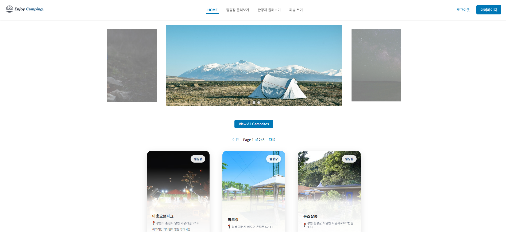
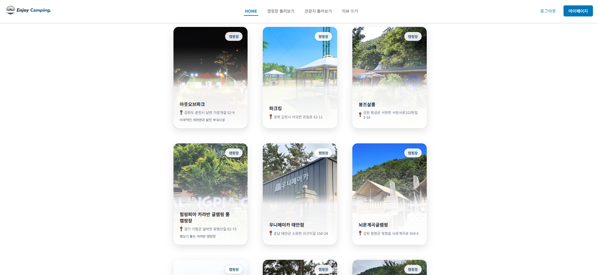
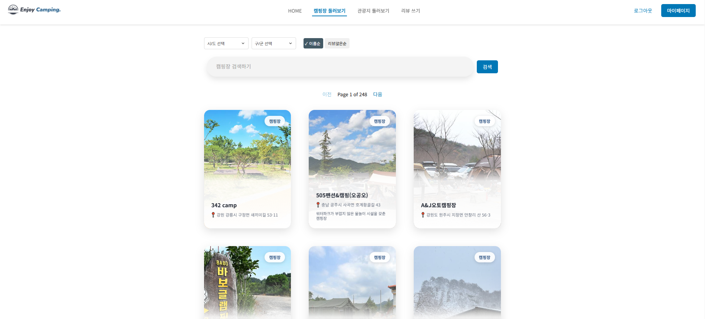
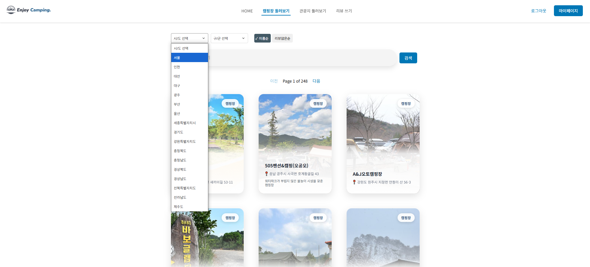
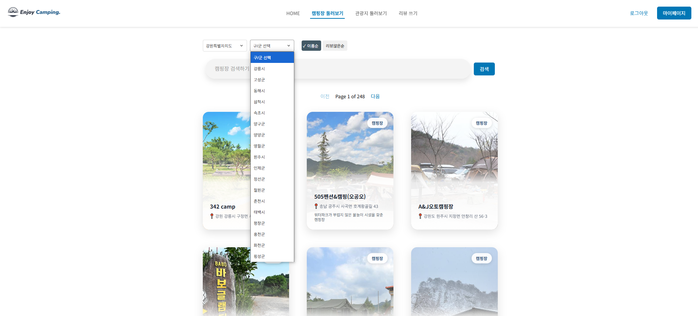
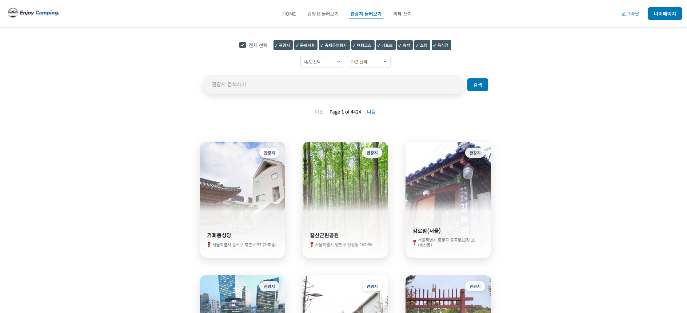
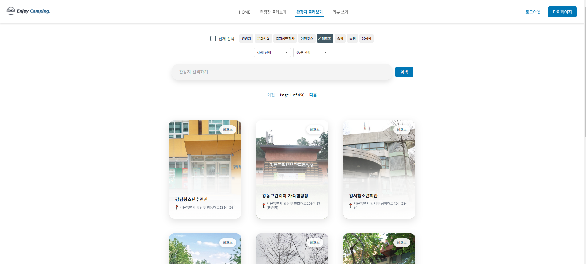
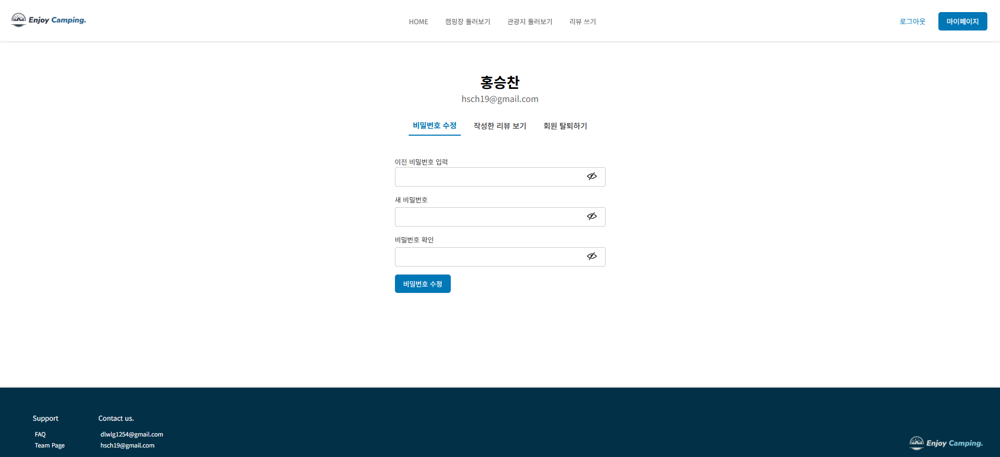

# EnjoyTrip

본 프로젝트는 SSAFY 12기 Java 관통 프로젝트 제출을 위해 개발되었습니다.

## 팀 소개
SSAFY 12기 서울 19반  
개발 기간 : 2024.10 ~ 2024.11  
팀장 : 이지호  
팀원 : 홍승찬

## 프로젝트 소개
- 캠핑 애호가들을 위한 종합 정보 플랫폼으로, 캠핑장 정보 제공부터 리뷰 시스템, 그리고 주변 관광지 정보까지 한 번에 확인할 수 있는 서비스를 제공합니다.

### 기본 기능
1. 캠핑장 정보 제공: 전국의 다양한 캠핑장 정보를 한눈에 볼 수 있습니다.
2. 리뷰 시스템: 사용자들이 캠핑장에 대한 경험을 공유하고 평가할 수 있습니다.
3. 지역별 검색: 시도 및 구군 단위로 캠핑장 검색이 가능합니다.
4. 주변 관광지 정보: 선택한 캠핑장 근처의 관광 명소를 가까운 순으로 조회할 수 있습니다.
5. 사용자 관리: 개인화된 서비스를 위한 사용자 계정 시스템을 제공합니다.

## 데이터베이스 구조

프로젝트는 다음과 같은 주요 테이블로 구성되어 있습니다:

- `user`: 사용자 정보 관리
- `camping`: 캠핑장 정보 저장
- `review`: 캠핑장 리뷰 관리
- `review_image`: 리뷰에 첨부된 이미지 관리
- `sidos` & `guguns`: 지역 정보 관리
- `attractions`: 관광지 정보 저장
- `contenttypes`: 관광지 유형 관리

## 기능 명세서(API 명세서)

## Use Case Diagram

## 페이지 구성
- **HOME**
  
  
  - 슬라이드 이미지 (캠핑 사진들)
  - View All Campsites 버튼
  - 페이지네이션 (이전 / 다음)
  - 캠핑장 조회

- **캠핑장 둘러보기**
  
  
  
  - 캠핑장 카드 리스트
    - 각 캠핑장 카드 정보
      - 캠핑장 이름
      - 위치 정보
      - 한줄 소개
      - 캠핑장 태그
  - 시/군/구 및 키워드로 검색

- **관광지 둘러보기**
  
  
  - 관광지 카드 리스트
    - 각 관광지 카드 정보
      - 관광지 이름
      - 위치 정보
      - 한줄 소개
      - 관광지 컨텐츠 타입 태그
  - 시/군/구 및 키워드로 검색
  - 태그별 조회

- **리뷰 쓰기**

- **사용자 메뉴**
  - 회원가입
  
  - 로그인
  
  - 마이페이지
  